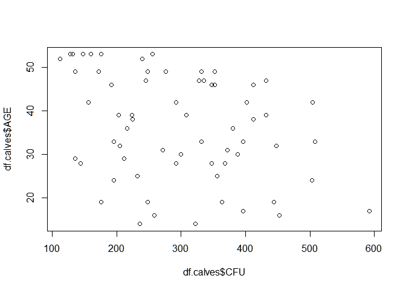

R Notebook for calve hutches experiment
================

This is an [R Markdown](http://rmarkdown.rstudio.com) Notebook for Raf Van De Mierop his master thesis on switching the direction of calve hutches.

Data import
===========

``` r
path <- "./Data.csv"
df.calves <- read.csv2(path)
summary(df.calves)
```

    ##      HUTCH         BOXFACTOR SWITCH      BEDDING           NOSE       
    ##  Min.   : 1.00   Min.   :1   NO :32   Min.   :11.00   Min.   :0.0000  
    ##  1st Qu.: 8.75   1st Qu.:1   YES:32   1st Qu.:22.00   1st Qu.:0.0000  
    ##  Median :16.50   Median :1            Median :24.50   Median :0.0000  
    ##  Mean   :16.50   Mean   :1            Mean   :24.16   Mean   :0.1875  
    ##  3rd Qu.:24.25   3rd Qu.:1            3rd Qu.:28.25   3rd Qu.:0.0000  
    ##  Max.   :32.00   Max.   :1            Max.   :36.00   Max.   :2.0000  
    ##       EYES            COUGH             TEMP           GENERAL     
    ##  Min.   :0.0000   Min.   :0.0000   Min.   :0.0000   Min.   :0.000  
    ##  1st Qu.:0.0000   1st Qu.:0.0000   1st Qu.:1.0000   1st Qu.:1.000  
    ##  Median :0.0000   Median :0.0000   Median :1.0000   Median :1.000  
    ##  Mean   :0.1562   Mean   :0.1875   Mean   :0.9375   Mean   :1.469  
    ##  3rd Qu.:0.0000   3rd Qu.:0.0000   3rd Qu.:1.0000   3rd Qu.:2.000  
    ##  Max.   :1.0000   Max.   :2.0000   Max.   :2.0000   Max.   :5.000  
    ##       AGE             FEED         TREATMENT        GENDER       SAMPLE   
    ##  Min.   :14.00   Min.   :2.000   Min.   :0   vrouwelijk:64   Min.   :1.0  
    ##  1st Qu.:28.00   1st Qu.:2.000   1st Qu.:0                   1st Qu.:1.0  
    ##  Median :37.00   Median :3.000   Median :0                   Median :1.5  
    ##  Mean   :36.19   Mean   :3.125   Mean   :0                   Mean   :1.5  
    ##  3rd Qu.:47.00   3rd Qu.:4.000   3rd Qu.:0                   3rd Qu.:2.0  
    ##  Max.   :53.00   Max.   :4.000   Max.   :0                   Max.   :2.0  
    ##       CORR            CFU         CORR_SAMPLE   
    ##  Min.   :12.00   Min.   :112.0   Min.   : 58.0  
    ##  1st Qu.:23.00   1st Qu.:204.5   1st Qu.:161.5  
    ##  Median :38.50   Median :292.0   Median :258.0  
    ##  Mean   :37.16   Mean   :296.2   Mean   :259.1  
    ##  3rd Qu.:48.25   3rd Qu.:374.0   3rd Qu.:340.0  
    ##  Max.   :69.00   Max.   :592.0   Max.   :549.0

You can already clearly see that some of the variables are obsolete, all are females, so that factor is useless

Some transformations are needed

``` r
df.calves$HUTCH <- as.factor(df.calves$HUTCH)
df.calves$SAMPLE <- as.factor(df.calves$SAMPLE)
```

Data exploration
================

We next need to explore our data of interest visually, namely both CFU samples.

``` r
hist(df.calves$CORR_SAMPLE,
     main = "Histogram for samples",
     xlab = "CFU")
```


So far it looks like the data is normally distributed when looking at the CFU.

Influencers of the CFU
======================

NEXT, let's take a look whether the CFU is influenced by some of the measures taken while sampling. For example age of the calve.

Model building
--------------

A [generalised linear model](https://en.wikipedia.org/wiki/Generalized_linear_model) is constructed with HUTCH as random effect.

First the baseline model is build, and next [univariate models](https://en.wikipedia.org/wiki/Univariate) are constructed for each of the variables.

    ## Loading required package: lme4

    ## Loading required package: Matrix

    ## Loading required package: lmerTest

    ## 
    ## Attaching package: 'lmerTest'

    ## The following object is masked from 'package:lme4':
    ## 
    ##     lmer

    ## The following object is masked from 'package:stats':
    ## 
    ##     step

    ## Loading required package: knitr

    ## summary from lme4 is returned
    ## some computational error has occurred in lmerTest

    ## Linear mixed model fit by REML ['lmerMod']
    ## Formula: CFU ~ 1 + (1 | HUTCH)
    ##    Data: df.calves
    ## 
    ## REML criterion at convergence: 777.8
    ## 
    ## Scaled residuals: 
    ##      Min       1Q   Median       3Q      Max 
    ## -1.53926 -0.78339 -0.05291  0.68042  2.46406 
    ## 
    ## Random effects:
    ##  Groups   Name        Variance Std.Dev.
    ##  HUTCH    (Intercept)  1045     32.33  
    ##  Residual             11618    107.78  
    ## Number of obs: 64, groups:  HUTCH, 32
    ## 
    ## Fixed effects:
    ##             Estimate Std. Error t value
    ## (Intercept)   296.25      14.64   20.24

This is the baseline model which can be subsequently used when adding explanatory variables.

### AGE

``` r
plot(df.calves$CFU, df.calves$AGE)
```



``` r
summary(glm1 <- lmer(CFU~ AGE +  (1|HUTCH), 
                        df.calves))
```

    ## Linear mixed model fit by REML t-tests use Satterthwaite approximations
    ##   to degrees of freedom [lmerMod]
    ## Formula: CFU ~ AGE + (1 | HUTCH)
    ##    Data: df.calves
    ## 
    ## REML criterion at convergence: 768.9
    ## 
    ## Scaled residuals: 
    ##      Min       1Q   Median       3Q      Max 
    ## -1.69829 -0.90826  0.01284  0.76464  2.21360 
    ## 
    ## Random effects:
    ##  Groups   Name        Variance  Std.Dev. 
    ##  HUTCH    (Intercept) 1.389e-10 1.179e-05
    ##  Residual             1.150e+04 1.072e+02
    ## Number of obs: 64, groups:  HUTCH, 32
    ## 
    ## Fixed effects:
    ##             Estimate Std. Error      df t value Pr(>|t|)    
    ## (Intercept)  406.343     42.938  62.000   9.463  1.2e-13 ***
    ## AGE           -3.042      1.127  62.000  -2.699  0.00895 ** 
    ## ---
    ## Signif. codes:  0 '***' 0.001 '**' 0.01 '*' 0.05 '.' 0.1 ' ' 1
    ## 
    ## Correlation of Fixed Effects:
    ##     (Intr)
    ## AGE -0.950

``` r
anova(baseline, glm1, test = "Chisq")
```

    ## refitting model(s) with ML (instead of REML)

    ## Data: df.calves
    ## Models:
    ## object: CFU ~ 1 + (1 | HUTCH)
    ## ..1: CFU ~ AGE + (1 | HUTCH)
    ##        Df    AIC    BIC  logLik deviance Chisq Chi Df Pr(>Chisq)   
    ## object  3 790.96 797.44 -392.48   784.96                           
    ## ..1     4 786.00 794.63 -389.00   778.00 6.966      1   0.008307 **
    ## ---
    ## Signif. codes:  0 '***' 0.001 '**' 0.01 '*' 0.05 '.' 0.1 ' ' 1

So it can be seen that age is influencing the CFU, but maybe this is due to the bedding?

### BEDDING

``` r
plot(df.calves$CFU, df.calves$BEDDING)
```


``` r
summary(glm2 <- lmer(CFU~ BEDDING + (1|HUTCH), 
                        df.calves))
```

    ## Linear mixed model fit by REML t-tests use Satterthwaite approximations
    ##   to degrees of freedom [lmerMod]
    ## Formula: CFU ~ BEDDING + (1 | HUTCH)
    ##    Data: df.calves
    ## 
    ## REML criterion at convergence: 772.1
    ## 
    ## Scaled residuals: 
    ##      Min       1Q   Median       3Q      Max 
    ## -1.49670 -0.84995 -0.04057  0.74925  2.32046 
    ## 
    ## Random effects:
    ##  Groups   Name        Variance Std.Dev.
    ##  HUTCH    (Intercept)   793.4   28.17  
    ##  Residual             11617.6  107.78  
    ## Number of obs: 64, groups:  HUTCH, 32
    ## 
    ## Fixed effects:
    ##             Estimate Std. Error      df t value Pr(>|t|)    
    ## (Intercept)  380.180     58.586  30.000   6.489 3.58e-07 ***
    ## BEDDING       -3.474      2.351  30.000  -1.478     0.15    
    ## ---
    ## Signif. codes:  0 '***' 0.001 '**' 0.01 '*' 0.05 '.' 0.1 ' ' 1
    ## 
    ## Correlation of Fixed Effects:
    ##         (Intr)
    ## BEDDING -0.969

``` r
anova(baseline, glm2, test = "Chisq")
```

    ## refitting model(s) with ML (instead of REML)

    ## Data: df.calves
    ## Models:
    ## object: CFU ~ 1 + (1 | HUTCH)
    ## ..1: CFU ~ BEDDING + (1 | HUTCH)
    ##        Df    AIC    BIC  logLik deviance  Chisq Chi Df Pr(>Chisq)
    ## object  3 790.96 797.44 -392.48   784.96                         
    ## ..1     4 790.71 799.35 -391.36   782.71 2.2483      1     0.1338

We can see that the bedding is not a significant influencer.

### SWITCH

What about switching the direction of the hutch.

``` r
plot(df.calves$CFU, df.calves$SWITCH)
```


``` r
summary(glm3 <- lmer(CFU~ SWITCH + (1|HUTCH), 
                        df.calves))
```

    ## Linear mixed model fit by REML t-tests use Satterthwaite approximations
    ##   to degrees of freedom [lmerMod]
    ## Formula: CFU ~ SWITCH + (1 | HUTCH)
    ##    Data: df.calves
    ## 
    ## REML criterion at convergence: 766.1
    ## 
    ## Scaled residuals: 
    ##      Min       1Q   Median       3Q      Max 
    ## -1.59528 -0.82194 -0.03131  0.60401  2.36143 
    ## 
    ## Random effects:
    ##  Groups   Name        Variance Std.Dev.
    ##  HUTCH    (Intercept)   590.5   24.3   
    ##  Residual             11617.6  107.8   
    ## Number of obs: 64, groups:  HUTCH, 32
    ## 
    ## Fixed effects:
    ##             Estimate Std. Error     df t value Pr(>|t|)    
    ## (Intercept)   270.94      20.00  30.00   13.55 2.53e-14 ***
    ## SWITCHYES      50.62      28.28  30.00    1.79   0.0836 .  
    ## ---
    ## Signif. codes:  0 '***' 0.001 '**' 0.01 '*' 0.05 '.' 0.1 ' ' 1
    ## 
    ## Correlation of Fixed Effects:
    ##           (Intr)
    ## SWITCHYES -0.707

``` r
anova(baseline, glm3, test = "Chisq")
```

    ## refitting model(s) with ML (instead of REML)

    ## Data: df.calves
    ## Models:
    ## object: CFU ~ 1 + (1 | HUTCH)
    ## ..1: CFU ~ SWITCH + (1 | HUTCH)
    ##        Df    AIC    BIC  logLik deviance  Chisq Chi Df Pr(>Chisq)  
    ## object  3 790.96 797.44 -392.48   784.96                           
    ## ..1     4 789.71 798.35 -390.86   781.71 3.2471      1    0.07155 .
    ## ---
    ## Signif. codes:  0 '***' 0.001 '**' 0.01 '*' 0.05 '.' 0.1 ' ' 1

And a tendency for an effect of switching the direction of the hutch.

Final model
-----------

Lets build the final model by adding an interaction between both

``` r
summary(glm4 <- lmer(CFU~ SWITCH * AGE + (1|HUTCH), 
                        df.calves))
```

    ## Linear mixed model fit by REML t-tests use Satterthwaite approximations
    ##   to degrees of freedom [lmerMod]
    ## Formula: CFU ~ SWITCH * AGE + (1 | HUTCH)
    ##    Data: df.calves
    ## 
    ## REML criterion at convergence: 750.4
    ## 
    ## Scaled residuals: 
    ##      Min       1Q   Median       3Q      Max 
    ## -1.69790 -0.81455 -0.05451  0.70850  2.39472 
    ## 
    ## Random effects:
    ##  Groups   Name        Variance  Std.Dev. 
    ##  HUTCH    (Intercept) 9.340e-13 9.664e-07
    ##  Residual             1.117e+04 1.057e+02
    ## Number of obs: 64, groups:  HUTCH, 32
    ## 
    ## Fixed effects:
    ##               Estimate Std. Error       df t value Pr(>|t|)    
    ## (Intercept)    734.549    174.340   59.949   4.213 8.59e-05 ***
    ## SWITCHYES     -362.482    189.577   59.949  -1.912  0.06065 .  
    ## AGE             -9.970      3.728   59.949  -2.675  0.00963 ** 
    ## SWITCHYES:AGE    8.018      4.654   59.949   1.723  0.09004 .  
    ## ---
    ## Signif. codes:  0 '***' 0.001 '**' 0.01 '*' 0.05 '.' 0.1 ' ' 1
    ## 
    ## Correlation of Fixed Effects:
    ##             (Intr) SWITCHYES AGE   
    ## SWITCHYES   -0.920                 
    ## AGE         -0.994  0.914          
    ## SWITCHYES:A  0.796 -0.960    -0.801

``` r
anova(baseline, glm4, test = "Chisq")
```

    ## refitting model(s) with ML (instead of REML)

    ## Data: df.calves
    ## Models:
    ## object: CFU ~ 1 + (1 | HUTCH)
    ## ..1: CFU ~ SWITCH * AGE + (1 | HUTCH)
    ##        Df    AIC    BIC  logLik deviance  Chisq Chi Df Pr(>Chisq)  
    ## object  3 790.96 797.44 -392.48   784.96                           
    ## ..1     6 786.05 799.00 -387.02   774.05 10.914      3     0.0122 *
    ## ---
    ## Signif. codes:  0 '***' 0.001 '**' 0.01 '*' 0.05 '.' 0.1 ' ' 1

Let's see if we can visualize this effect a bit more niecely.

### Final model plots

``` r
if (!require("effects")) {
  install.packages("effects", dependencies = TRUE)
  library(effects)
}
```

    ## Loading required package: effects

    ## Loading required package: carData

    ## lattice theme set by effectsTheme()
    ## See ?effectsTheme for details.

``` r
if (!require("lsmeans")) {
  install.packages("lsmeans", dependencies = TRUE)
  library(lsmeans)
}
```

    ## Loading required package: lsmeans

    ## The 'lsmeans' package is being deprecated.
    ## Users are encouraged to switch to 'emmeans'.
    ## See help('transition') for more information, including how
    ## to convert 'lsmeans' objects and scripts to work with 'emmeans'.

    ## 
    ## Attaching package: 'lsmeans'

    ## The following object is masked from 'package:lmerTest':
    ## 
    ##     lsmeans

``` r
plot(effect("SWITCH:AGE", 
            glm4, 
            #xlevels=list(CALC_ARRIVAL=900:2000), 
            multiline=TRUE),
     main = "Interaction between switching and age",
     xlab = "Age",
     ylab = "CFU")
```

 \`\`\`
